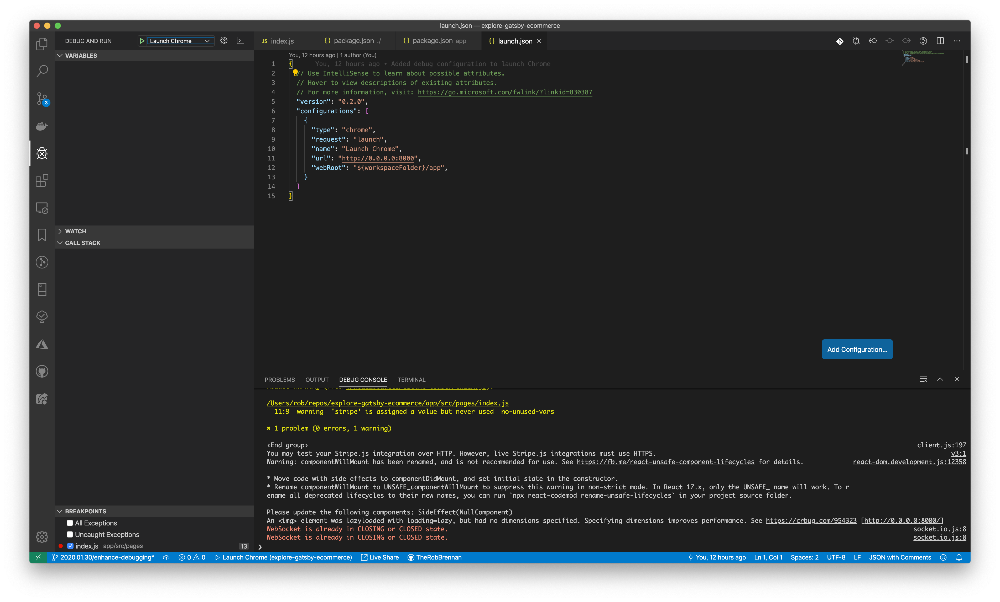
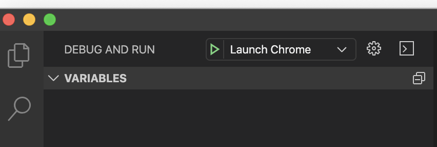
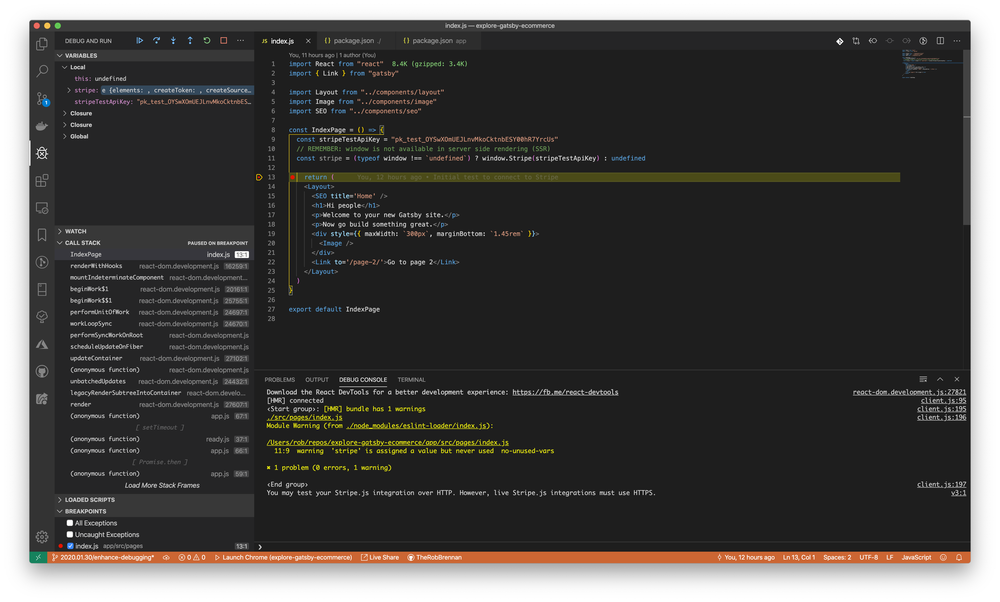
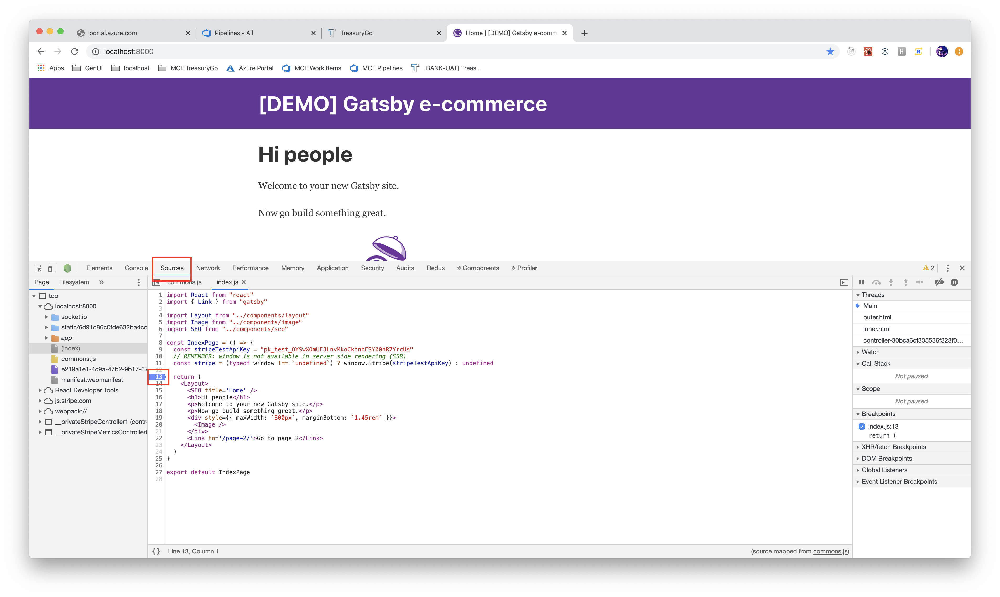
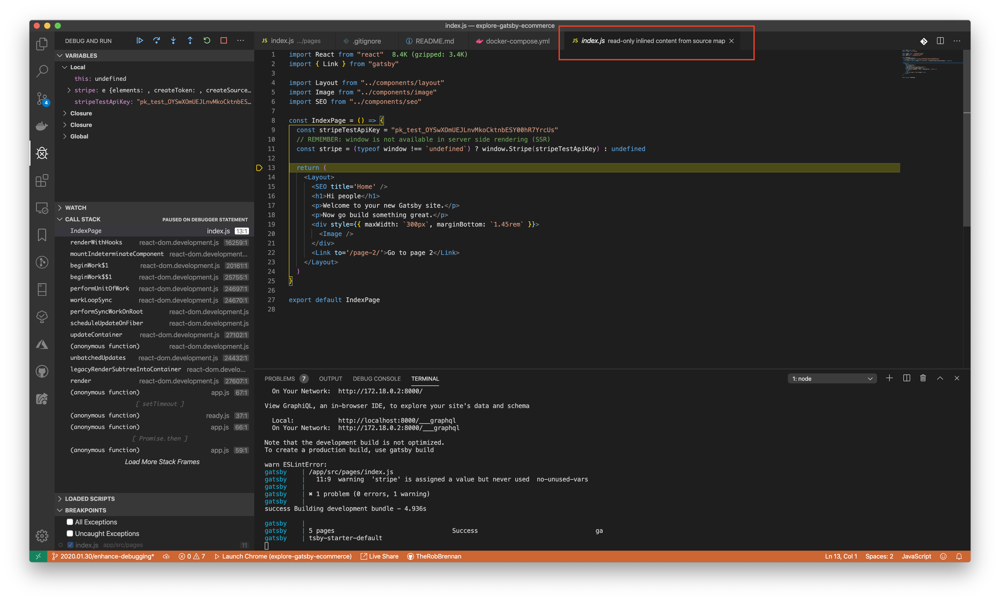
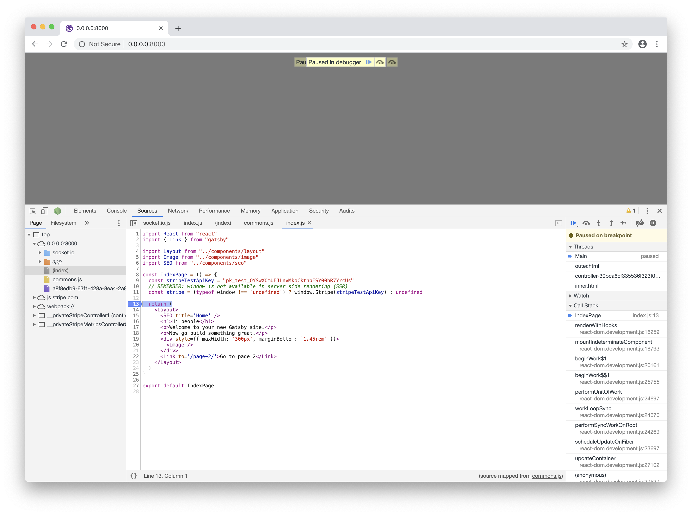

# Welcome

This project has been created to explore some initial thoughts and ideas when working with Gatsby and ecommerce.

You can view the latest [DEMO](https://explore-gatsby-ecommerce.now.sh) at [https://explore-gatsby-ecommerce.now.sh](https://explore-gatsby-ecommerce.now.sh)

## Getting started

This example is intended to work with [Docker](https://www.docker.com) and a new app generated by the [Gatsby CLI](https://www.gatsbyjs.com) - as well as being able to run locally on your development machine.

For debugging the application using [VS Code](https://code.visualstudio.com), there are two approaches you can take:

+ Run the `debug` script from the top level `package.json` and set breakpoints within VS Code
+ Start the application within the Docker environment and then use Chrome DevTools to set breakpoints

Please see the section on "Debugging your application with VS Code" below for more details.

Assuming you have a program such as [Docker Desktop on Mac](https://docs.docker.com/docker-for-mac/install/) or equivalent for your platform, you should be able to run this project immediately with:

```sh
$ npm start
> explore-gatsby-ecommerce@0.0.0 start /Users/rob/repos/explore-gatsby-ecommerce
> docker-compose up

Creating network "explore-gatsby-ecommerce_default" with the default driver
Creating gatsby ... done
Attaching to gatsby
gatsby    | 
gatsby    | > gatsby-starter-default@0.1.0 develop /app
gatsby    | > gatsby develop -H 0.0.0.0
gatsby    | 
gatsby    | ╔════════════════════════════════════════════════════════════════════════╗
gatsby    | ║                                                                        ║
gatsby    | ║   Gatsby collects anonymous usage analytics                            ║
gatsby    | ║   to help improve Gatsby for all users.                                ║
gatsby    | ║                                                                        ║
gatsby    | ║   If you'd like to opt-out, you can use `gatsby telemetry --disable`   ║
gatsby    | ║   To learn more, checkout https://gatsby.dev/telemetry                 ║
gatsby    | ║                                                                        ║
gatsby    | ╚════════════════════════════════════════════════════════════════════════╝
^[[22;183Rgatsby    | success open and validate gatsby-configs - 0.018s
gatsby    | /bin/sh: lscpu: not found
gatsby    | success load plugins - 0.357s
gatsby    | success onPreInit - 0.002s
gatsby    | success initialize cache - 0.010s
gatsby    | success copy gatsby files - 0.288s
gatsby    | success onPreBootstrap - 0.012s
gatsby    | success createSchemaCustomization - 0.005s
gatsby    | success source and transform nodes - 0.074s
gatsby    | success building schema - 0.275s
gatsby    | success createPages - 0.001s
gatsby    | success createPagesStatefully - 0.086s
gatsby    | success onPreExtractQueries - 0.006s
gatsby    | success update schema - 0.030s
gatsby    | success extract queries from components - 0.267s
gatsby    | success write out requires - 0.045s
gatsby    | success write out redirect data - 0.003s
gatsby    | success Build manifest and related icons - 0.173s
gatsby    | success onPostBootstrap - 0.188s
gatsby    | ⠀
gatsby    | info bootstrap finished - 3.593 s
gatsby    | ⠀
success run queries - 0.040s - 7/7 173.74/s
⠀
You can now view gatsby-starter-default in the browser.
⠀
  Local:            http://localhost:8000/
  On Your Network:  http://172.19.0.2:8000/
⠀
View GraphiQL, an in-browser IDE, to explore your site's data and schema
⠀
  Local:            http://localhost:8000/___graphql
  On Your Network:  http://172.19.0.2:8000/___graphql
⠀
Note that the development build is not optimized.
To create a production build, use gatsby build
⠀
success Building development bundle - 4.148s

gatsby    | 
gatsby    | 5 pages                                Success                                ga
gatsby    | tsby-starter-default

```

The app should be available at [http://localhost:8000](http://localhost:8000).

The GraphiQL IDE should be available at [http://localhost:8000/___graphql](http://localhost:8000/___graphql)

### Debugging your application with VS Code

For debugging the application using [VS Code](https://code.visualstudio.com), there are two approaches you can take:

+ Run the `debug` script from the top level `package.json` and set breakpoints
+ Start the application within the Docker environment and then use Chrome DevTools to set breakpoints

#### Option 1: Run the debug script

This project contains a sample [VS Code](https://code.visualstudio.com) debug launch configuration so that you can view a locally running instance of the app (e.g. not running the app within a Docker container):



First, you'll want to run the `debug` script on your development machine so that the Gatsby application launches with debugging enabled:

```sh
$ npm run debug
```

You can then set breakpoints within [VS Code](https://code.visualstudio.com) and run the `Launch Chrome` debug configuration in [VS Code](https://code.visualstudio.com):



You will see rich debugging information such as:



#### Option 2: Debug the locally running Docker application

If you have the application running within Docker, you can still take advantage of [VS Code](https://code.visualstudio.com)'s rich debugging interface.

Assuming that you already have the Dockerized application running, you'll want to run the `Launch Chrome` debug configuration in [VS Code](https://code.visualstudio.com):


Once Chrome is launched, you can then open up the Dev Tools, view `Sources`, and then browse to the appropriate file(s) you're interested in and set breakpoints:



When the breakpoint is hit, the [VS Code](https://code.visualstudio.com) debugger will open up and you will get to see a wealth of information:



If you return to the Chrome browser, you will notice that it indicates the debugger has paused execution:



### Deployment to ZEIT Now

As a bonus, I wanted to configure this project so that I can deploy it to my favorite static and [JAMstack](https://jamstack.org) host - [ZEIT Now](https://zeit.co).

Feel free to configure `now.json` to match a project name for your (free) [ZEIT Now](https://zeit.co) account and then you can deploy the site with:

```sh
$ npm run deploy

> explore-gatsby-ecommerce@0.0.0 deploy /Users/rob/repos/explore-gatsby-ecommerce
> npm run deploy:zeit-now


> explore-gatsby-ecommerce@0.0.0 deploy:zeit-now /Users/rob/repos/explore-gatsby-ecommerce
> now --prod

> Deploying ~/repos/explore-gatsby-ecommerce under therobbrennan
> Using project explore-gatsby-ecommerce
> Synced 1 file [2s]
> https://explore-gatsby-ecommerce-jfow89xq2.now.sh [2s]
> Ready! Deployment complete [51s]
- https://explore-gatsby-ecommerce.now.sh
- [in clipboard]
```

In the example deployment above, note that our site is available at [https://explore-gatsby-ecommerce.now.sh](https://explore-gatsby-ecommerce.now.sh) as well as a link to this specific deployment [https://explore-gatsby-ecommerce-jfow89xq2.now.sh](https://explore-gatsby-ecommerce-jfow89xq2.now.sh) along with the free `.now.sh` [URL](https://explore-gatsby-ecommerce.now.sh) associated with your project.

## Additional resources

### REFERENCE: Create a new Gatsby app

To create a new Gatsby app, I will use `npx` to create a new [Gatsby](https://www.gatsbyjs.com) app using the latest version of the [Gatsby CLI](https://www.gatsbyjs.com):

```sh
# Generate a new app using the latest version of the Gatsby CLI
$ npx gatsby new app

# Navigate to the app directory and verify the app loads
$ cd app
$ npx gatsby develop

success open and validate gatsby-configs - 0.023s
success load plugins - 0.531s
success onPreInit - 0.003s
success initialize cache - 0.009s
success copy gatsby files - 0.049s
success onPreBootstrap - 0.015s
success createSchemaCustomization - 0.004s
success source and transform nodes - 0.085s
success building schema - 0.282s
success createPages - 0.002s
success createPagesStatefully - 0.058s
success onPreExtractQueries - 0.002s
success update schema - 0.029s
success extract queries from components - 0.242s
success write out requires - 0.021s
success write out redirect data - 0.002s
success Build manifest and related icons - 0.104s
success onPostBootstrap - 0.128s
⠀
info bootstrap finished - 4.475 s
⠀
success run queries - 0.150s - 8/8 53.28/s
success Generating image thumbnails - 2.297s - 6/6 2.61/s

You can now view gatsby-starter-default in the browser.
⠀
  http://localhost:8000/
⠀
View GraphiQL, an in-browser IDE, to explore your site's data and schema
⠀
  http://localhost:8000/___graphql
⠀
Note that the development build is not optimized.

To create a production build, use gatsby build
⠀
success Building development bundle - 4.403s

```

The app should be available at [http://localhost:8000](http://localhost:8000).

The GraphiQL IDE should be available at [http://localhost:8000/___graphql](http://localhost:8000/___graphql)
